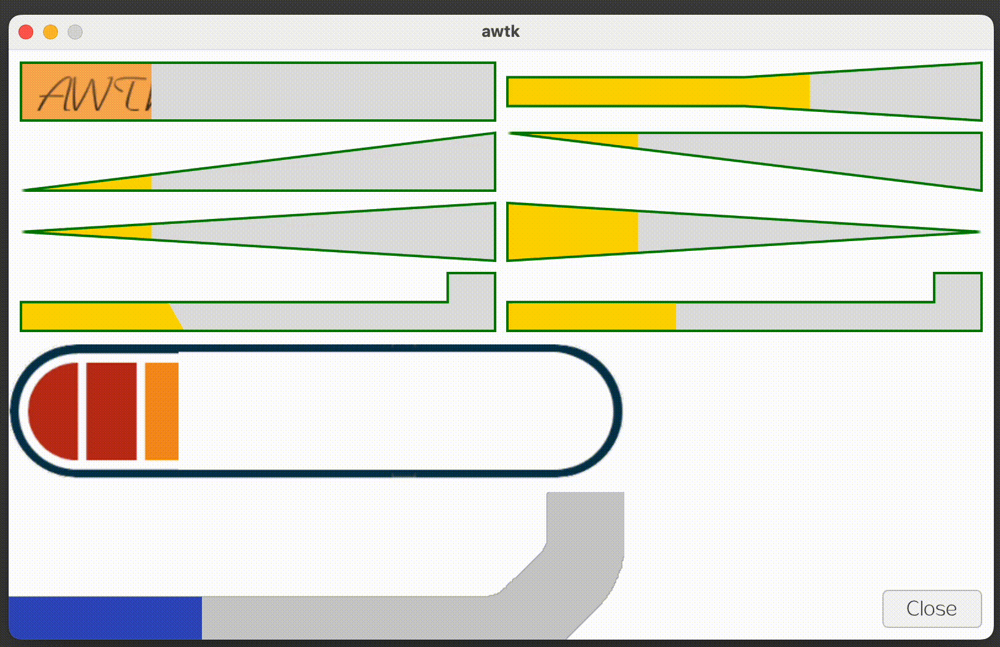

# awtk-widget-progress-polygon

异形进度条控件。通过多边形来定义进度条的形状。



## 特性

* 通过多边形定义进度条的形状
* 支持通过图片来定义进度条的背景
* 支持通过图片来定义进度条的前景

> 使用图片填充比使用颜色填充消耗更多的内存和 CPU，所以在性能要求较高的场景下，尽量使用颜色填充。

## 用法

多边形的描述用一组 5 元组表示，每个 5 元组包含：

* value: 进度值 (0-1), 0 表示进度为 0，1 表示进度完成
* x1: 第一个点的 x 坐标。如果取值 [0,1] 之间，则实际的值为 x1 * width。
* y1: 第一个点的 y 坐标。如果取值 [0,1] 之间，则实际的值为 y1 * height。
* x2: 第二个点的 x 坐标。如果取值 [0,1] 之间，则实际的值为 x2 * width。
* y2: 第二个点的 y 坐标。如果取值 [0,1] 之间，则实际的值为 y2 * height。

它的表示进度为 value 时，进度条对应的上下或左右两个点的坐标。

> 元组的个数不限，对于直线，描述转折点即可，对于曲线形状，采样就要多一些，才能画出更平滑的曲线。

> 使用图片填充时，把图片不需要的部分做成透明色，则坐标描述不需要太精确，将图片有用部分包括在其中即可。

### 示例 1 - 传统矩形进度条

* 进度为0时，上下的坐标分别为 (0,0) 和 (0,1)
* 进度为1时，上下的坐标分别为 (1,0) 和 (1,1)

```xml
 <progress_polygon polygon="(0, 0,0,0,1)(1, 1,0,1,1)"/>
```

### 示例 2 - 三角形进度条

* 进度为0时，上下的坐标分别为 (0,1) 和 (0,1)
* 进度为1时，上下的坐标分别为 (1,0) 和 (1,1)

```xml
<progress_polygon polygon="(0, 0,1,0,1)(1, 1,0,1,1)" />
```

## 准备

1. 获取 awtk 并编译

```
git clone https://github.com/zlgopen/awtk.git
cd awtk; scons; cd -
```

## 运行

1. 生成示例代码的资源

```
python scripts/update_res.py all
```
> 也可以使用 Designer 打开项目，之后点击 “打包” 按钮进行生成；
> 如果资源发生修改，则需要重新生成资源。

如果 PIL 没有安装，执行上述脚本可能会出现如下错误：
```cmd
Traceback (most recent call last):
...
ModuleNotFoundError: No module named 'PIL'
```
请用 pip 安装：
```cmd
pip install Pillow
```

2. 编译

* 编译 PC 版本

```
scons
```

* 编译 LINUX FB 版本

```
scons LINUX_FB=true
```

> 完整编译选项请参考 [编译选项](https://github.com/zlgopen/awtk-widget-generator/blob/master/docs/build_options.md)

3. 运行

```
./bin/demo
```

## 文档

[完善自定义控件](https://github.com/zlgopen/awtk-widget-generator/blob/master/docs/improve_generated_widget.md)
